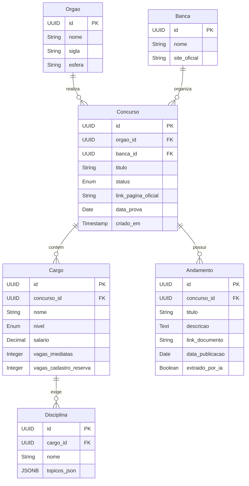

# Banco de Dados

## Diagrama Entidade-Relacionamento (ER)

O banco de dados relacional (PostgreSQL) foi modelado para garantir integridade e normalização em todas as instâncias da vida de um edital de concurso. 

As entidades principais e seus relacionamentos são os seguintes:

## Dicionário de Dados
- **Órgão:** A entidade governamental que contrata (Ex: SEDF, Polícia Civil).
- **Banca:** A organizadora do certame (Ex: Cebraspe, FGV).
- **Concurso:** O agrupador principal (O "Edital" em si).
- **Cargo:** Específico dentro do concurso (Ex: Professor de Matemática, Agente).
- **Andamento:** As atualizações que o Scraper capta (Gabarito, Retificações).
- **Disciplina:** Conteúdo cobrado, extraído pela Inteligência Artificial.
